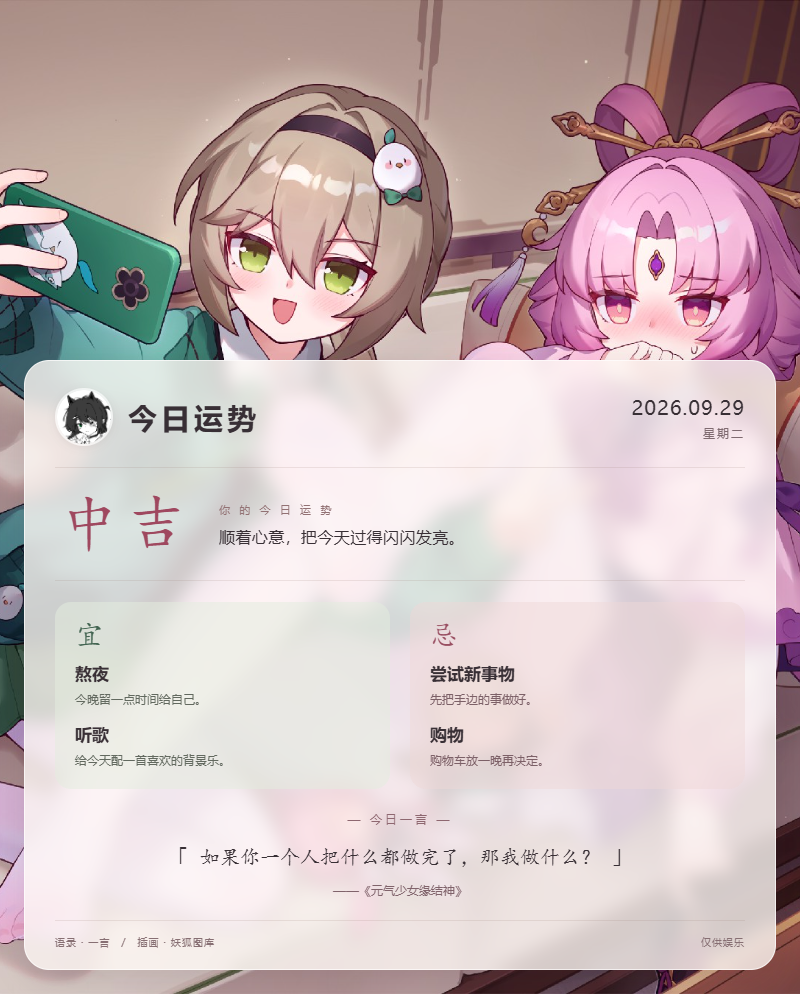

# 今日运势与今日老婆

给群友抽一张当天的运势卡：头像、二次元插画、吉凶、宜忌和一言。文字区是半透明面板，不显示昵称，也没有签到、经验、等级或货币。

作者：**yun474**。插件名：`astrbot_plugin_daily_fortune`。



预览使用演示头像；实际运行时读取发消息的用户头像。云云把确认过的这张图留在仓库啦，后续改版也能直接对照。

## 使用

```text
/今日运势
/jrys
/运势
```

命令前缀由 AstrBot 设置决定。QQ 官方群聊按平台要求先 @ 机器人。

- 支持 QQ 官方 WebSocket、QQ 官方 Webhook，以及 OneBot（aiocqhttp）。
- 不请求昵称。官方群聊使用 `member_openid`，私聊使用 `user_openid`，结合适配器的 AppID 获取头像；频道消息使用事件作者的头像 URL。不会把 OpenID 当成 QQ 号。
- 运势按平台实例、用户 ID 和北京时间日期固定；宜忌从不同事项中抽取，不会出现同一事项既宜又忌。
- 首次请求获取插画、一言和头像，生成 PNG；当天后续请求直接读取成图，重启也能复用。更换配置会重新渲染，吉凶宜忌仍然固定。清除缓存后，插画和一言可能变化。
- 头像取不到时使用通用头像；插画和一言各有一个内置替代。浏览器不可用时回复文字运势。

## 安装

将本项目放入 `AstrBot/data/plugins/astrbot_plugin_daily_fortune/`，在 **AstrBot 使用的 Python 环境中**安装依赖和浏览器：

```bash
python -m pip install -r requirements.txt
python -m playwright install chromium
```

Linux/Docker 还需浏览器运行库和中文字体，例如 Debian/Ubuntu：

```bash
python -m playwright install-deps chromium
apt-get update && apt-get install -y fonts-noto-cjk
```

容器中安装的浏览器和字体需要写入镜像或持久化，重建容器后才不会丢失。已有 Chrome/Chromium 时，也可以在插件配置中填写可执行文件路径。

仓库地址：[yun474/astrbot_plugin_daily_fortune](https://github.com/yun474/astrbot_plugin_daily_fortune)。可在 AstrBot 插件管理中选择从链接安装，填入此仓库地址；浏览器和中文字体仍需按上面的步骤准备。

## 配置

| 配置项 | 默认值 / 作用 |
| --- | --- |
| `background_url` | 妖狐普通二次元图源；也可填直接返回图片的 HTTP(S) 地址或本地路径 |
| `background_credit` | 图片来源署名，默认“妖狐图库” |
| `hitokoto_api` | 一言动画/漫画分类；留空使用内置句子 |
| `browser_executable_path` | 留空使用 Playwright Chromium，也可填写系统浏览器路径 |

背景地址应直接返回图片，不要填返回 JSON 的接口地址。本地相对路径以插件目录为基准；使用 `assets/default_background.jpg` 可关闭背景联网请求。

缓存位于 `data/plugin_data/astrbot_plugin_daily_fortune/cards/`，只保存日期目录和以哈希命名的成图，不写用户昵称、签到信息或 OpenID 明文。每个有新图片生成的日期会清理超过七天的历史目录。生成并发限制为 2，同一用户同一天的并发请求合并为一次生成。

## 兼容性与验证

- **声明最低 AstrBot：3.5.3**。源码核对显示，本插件使用的 `StarTools.get_data_dir`、`AstrMessageEvent.get_platform_id` 已在该版本存在，而 3.5.2 尚未具备两者；注册器、命令别名和 QQ 官方适配器字段也按旧版路径使用。
- 同时检查了 AstrBot **4.28.1** 开发源码（`b53999e`）中的 QQ 官方 WebSocket/Webhook 字段。未把这个源码核对版本抬为技术最低版本。
- 本地验证环境：Python 3.12、Playwright 1.63、Windows Chrome。核心逻辑测试、真实 API 下载及 Python 模板截图已通过，中文与半透明布局已查看。
- **尚未连接真实 QQ 官方机器人账号进行消息收发验收**，也未启动上述 AstrBot 版本做完整运行测试。头像 URL 的真实 AppID/OpenID 访问和平台图片发送仍需部署验证。

运行测试和离线模板预览：

```bash
python -m pip install pytest pytest-asyncio qq-botpy
python -m pytest -q
python scripts/render_preview.py
# 如果使用系统浏览器：
python scripts/render_preview.py --browser /usr/bin/chromium
```

预览脚本默认生成 `.test-output/python-preview.png`，不会覆盖仓库保存的 `docs/preview.png`；可用 `--avatar` 传本地头像文件。独立 Node 原型、参考仓库和虚拟环境已排除出 Git。

## 来源与许可

- [参考插件](https://github.com/fiatlux2333/astrbot_plugin_jrys)：参考了本地每日抽签和 HTML 截图的思路，本项目代码、布局与文案重新实现。
- [一言](https://developer.hitokoto.cn/sentence/)：公益接口，默认全球线路限 2 QPS；请勿高频调用。单用户当日成图会缓存，一言请求额外限制为至少间隔 0.55 秒。
- [妖狐图库](https://acg.yaohud.cn/)：默认使用普通二次元接口，服务方声明全年龄、免费非商业用途。免费接口可用性不作保证。
- 代码为 MIT；第三方插画和预览图单独说明于 [图片来源](assets/NOTICE.md)，不随代码重新授权。商业场景请替换成有明确授权的素材。


## 今日老婆

同一个插件新增 `/今日老婆`（别名 `/jrlp`、`/抽老婆`），原有今日运势命令不变。

QQ 官方群聊、私聊及对应 Webhook 直接发送 Markdown：开头艾特触发用户，显示“您的今日老婆是：角色名”、作品名和公网原图，底部两个按钮为“今日老婆”“今日运势”。按钮不带斜杠、唤醒词或手工艾特，QQ 自动艾特机器人。

- 使用 [monbed/wife 免费图库](https://github.com/monbed/wife)，列表缓存一天，同一用户当天固定角色；已抽结果跨重启保留，列表刷新不会影响当天结果。
- `wife_list_url` 配置角色列表，`wife_image_base` 配置图片公网基础地址。默认 GitHub 原图，QQ 拉取不稳定时可切换到同路径的自建图床或镜像。
- 请求顶层开启 `force_verify_image_resource=true`。明确的图片下载、转存、校验失败等待一秒重试一次；不重新抽取。权限错误、未知错误及超时不盲目重试。
- 原生 Markdown 不合成头像、不查询昵称。OneBot 和频道场景发送普通文字（角色及作品）和原图。
- 沿用原插件名及缓存目录，方便已安装用户直接更新。版本保持 `0.1.0`。
- QQ SDK 随 AstrBot 官方适配器提供。直接调用其已鉴权 HTTP 客户端，透传图片校验和按钮字段。

下面保留此前确认的合成图预览，供普通图片样式参考；QQ 原生 Markdown 的实际布局由客户端渲染，当前普通图片发送的是原图。


[原生 Markdown 请求示例](docs/wife-qq-payload.json) · [发送与重试说明](docs/wife-qq-send.md)

本地测试验证群聊/私聊路由、按钮内容、强制图片校验、一次重试和每日缓存，真实 QQ 消息仍需部署后验收。
